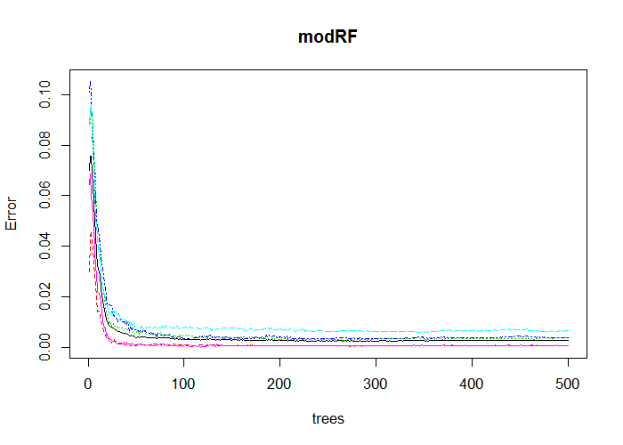
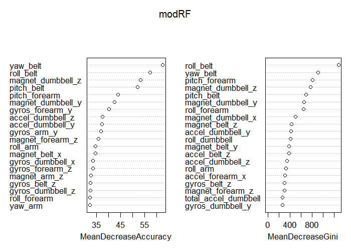
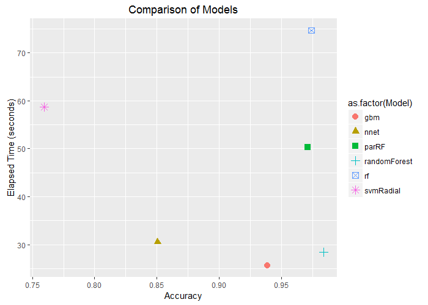
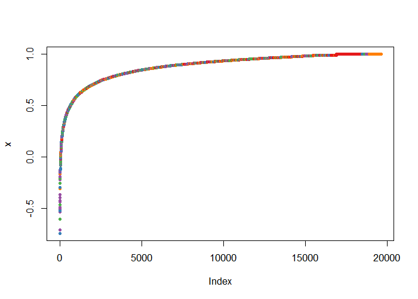

# Practical Machine Learning Course Project


## I. Introduction

This report describes **randomForest**, a machine learning algorithm, to `predict` activity manners from activity monitors, explaining how the model was built on a labeled data, how cross-validation was used to estimate the out of sample error rate, and why the key decisions were made during the analysis. The report reviews the accuracy of the selected machine learning algorithm in predicting the 20 unlabeled test cases.  

The data originated from this [source](http://groupware.les.inf.puc-rio.br/har) consists of a set of labeled readings from accelerometers attached to the belt, forearm, arm, and dumbell of 6 participants, who were asked to perform barbell lifts correctly and incorrectly in 5 different manners (`classe`), and testing data without class labels.   

The submission includes index.Rmd and index.html files with figures as well as answer-files, which can be found in [github pages branch](https://github.com/mjdata/practicalmachinelearning/tree/gh-pages).  

### The key decisions made in the analysis:  

 * Why is Random Forests chosen?   
    + The `features` of Random Forests model sound very appealing, as described [here](https://www.stat.berkeley.edu/~breiman/RandomForests/cc_home.htm#features), 
e.g. high accuracy, high efficiency, no overfit, no need for separate cross-validation or a separate test set to get an unbiased estimate of the test set error, etc.
    + Model Comparison in part 4 demonstrates that randomForest indeed excels.

 * How is a `randomForest` model built? 
    + Build directly randomForest::randomForest without caret::train interface.  
    + The default, mtry = sqrt(ncol(x)), is chosen for the only parameter.  
    + The cross-validation (cv) and out-of-bag (oob) error estimation are done `internally`, when the randomForest model runs.  
    + Used all samples to obtain higher accuracy, since no need to set aside cv and test sets.   
    + Used all 52 predictors to get lower bias, without worrying about over fitting, because random forest manages the bias-variance trade-off. 
    
 * How are models built through caret::train interface?
    + 3-fold cross validation for all models
    + Default or limited tuning for model parameters
    
 * Compare both `speed and errors` (`OOB`: training error; `OOS`: test error)
 
 * Utilize `parallel processing` for time efficiency. 
 
## II. Data Preparation    

### Loading libraries and data     


```r
if (!file.exists("data")){dir.create("data")}
if(!file.exists("./data/pml-training.csv")){
    trainUrl <- "https://d396qusza40orc.cloudfront.net/predmachlearn/pml-training.csv"
    download(trainUrl, destfile = "./data/pml-training.csv")}
if(!file.exists("./data/pml-testing.csv")){
    testUrl <- "https://d396qusza40orc.cloudfront.net/predmachlearn/pml-testing.csv"
    download(testUrl, destfile = "./data/pml-testing.csv")}
pml_training <- read_csv("./data/pml-training.csv") 
pml_testing <- read_csv("./data/pml-testing.csv");
cat("Raw data, training:",dim(pml_training), "testing:",dim(pml_testing), "\n")
```

```
Raw data, training: 19622 160 testing: 20 160 
```

```r
cat("Class population -- Training data: \n")
```

```
Class population -- Training data: 
```

```r
table(pml_training$classe); round(prop.table(table(pml_training$classe)), 4)
```

```

   A    B    C    D    E 
5580 3797 3422 3216 3607 
```

```

     A      B      C      D      E 
0.2844 0.1935 0.1744 0.1639 0.1838 
```

### Data cleaning and filtering     

```r
training <- pml_training; testing <- pml_testing 
# Remove non accelerometer meaurements columns
training <- training[, -(1:7)]; testing <- testing[, -(1:7)];  
#cat("Removing non-accelerometer varaibles: ", names(pml_training)[1:7], "\n")
# Remove the mostly "NA" columns 
colsNA <- sapply(training, function(x) mean(is.na(x))) > 0.95
NA_names <- names(training[, colsNA == T])
training <- training[, colsNA == F]; testing <- testing[, colsNA == F];
cat("Eliminated",length(NA_names),"mostly NA columns", "\n")
```

```
Eliminated 76 mostly NA columns 
```

### Remove the variabls with zero or nearly zero variance    

```r
#library(caret)
nzv <- nearZeroVar(training); nzv_names <- names(training[, nzv])
training <- training[, -nzv];  testing <- testing[, -nzv];
cat("Eliminating",length(nzv),"features with nearly zero variance", "\n")
```

```
Eliminating 24 features with nearly zero variance 
```
### Sensor-readings variables are not eliminated  

```r
nameDrop <- c(NA_names, nzv_names); 
splitf <- function(s) str_split(s, "_")[[1]][1] 
firstw <- unique(sapply(nameDrop, splitf)); 
cat("The names of the",length(nameDrop),"eliminated variables start with (",firstw,"), which represent statistics rather than sensor readings.", "\n")
```

```
The names of the 100 eliminated variables start with ( max min amplitude var avg stddev kurtosis skewness ), which represent statistics rather than sensor readings. 
```
### Impute a few "NA"     

```r
library(caret)
if (sum(is.na(training)) > 0){ 
    imputX <- preProcess(training, method = c("medianImpute"))
    training <- predict(imputX, training)}
if (sum(is.na(testing)) > 0){
    imputX <- preProcess(testing, method = c("medianImpute"))
    testing <- predict(imputX, testing)}
```
### Check linear combinations      

```r
comboInfo <- findLinearCombos(training[, -ncol(training)]);  comboInfo$remove 
```

```
NULL
```

```r
tidyTrain <- training; tidyTest <- testing
```

## III. randomForest::randomForest Model  

### Build randomForest classifier with un-partitioned tidy data  

```r
# library(randomForest) 

xtrain <- tidyTrain[, -ncol(tidyTrain)]; 
ytrain <- as.factor(tidyTrain$classe)
dim(xtrain) 
```

```
[1] 19622    52
```

```r
# Register parallel processing
cl <- makePSOCKcluster(detectCores());  
clEv <- clusterEvalQ(cl, library(foreach))
registerDoParallel(cl)
 
set.seed(823)
time.RF <- system.time(modRF <- 
                randomForest(xtrain, ytrain, 
                            importance = T))
# Unregister parallel processing
stopCluster(cl); registerDoSEQ()
modRF
```

```

Call:
 randomForest(x = xtrain, y = ytrain, importance = T) 
               Type of random forest: classification
                     Number of trees: 500
No. of variables tried at each split: 7

        OOB estimate of  error rate: 0.27%
Confusion matrix:
     A    B    C    D    E  class.error
A 5577    3    0    0    0 0.0005376344
B   11 3783    3    0    0 0.0036871214
C    0   10 3409    3    0 0.0037989480
D    0    0   19 3195    2 0.0065298507
E    0    0    0    2 3605 0.0005544774
```

```r
time.RF
```

```
   user  system elapsed 
 213.36    0.36  214.60 
```

### Plot.randomForest (plot1) 

```r
plot(modRF)
```

<div class="rimage center"></div>

```r
# 
```

### Function to print performance of randomForest model

```r
perfmRF <- function(x, timeRF, xsize){
    
    OOB <- x$err.rate[x$ntree, "OOB"]
    OOB <- round(as.numeric(OOB), 4)
    kappa <- NA
    timeRF <- round(as.numeric(timeRF), 2)
    
    oob.rf <- data_frame(
        Model = "randomForest", 
        Accuracy = (1 - OOB), Kappa = kappa, OOB = OOB, 
        User = timeRF[1], Sys = timeRF[2], Elaps = timeRF[3],
        Obs = xsize[1], Vars = xsize[2])
    oob.rf
}  
```


```r
perfm.RF <- perfmRF(modRF, time.RF, dim(xtrain))
perfm.RF
```

```
# A tibble: 1 x 9
         Model Accuracy Kappa    OOB   User   Sys Elaps   Obs  Vars
         <chr>    <dbl> <lgl>  <dbl>  <dbl> <dbl> <dbl> <int> <int>
1 randomForest   0.9973    NA 0.0027 213.36  0.36 214.6 19622    52
```

### Importance of predictors from randomForest  

```r
# Important predictors from randomForest
imp <- as.data.frame(importance(modRF))
imp <- mutate(imp, vnames = rownames(imp))
impVar <- arrange(imp, desc(MeanDecreaseAccuracy))[1:20,8]
```

### Plot important predictors (plot2)  

```r
varImpPlot(modRF, n.var = min(20, nrow(modRF$importance)))
```

<div class="rimage center"></div>

```r
# 
```

## IV. Model Comparison: using small partitioned data 

### Partition the tidy train data      

```r
set.seed(135)
inTrain <- createDataPartition(tidyTrain$classe, p = 0.80, list = F)
trainD <- tidyTrain[inTrain,]; testD <- tidyTrain[-inTrain,];
cat("Partitioned, trainD:",dim(trainD), "testD:",dim(testD), "\n")
```

```
Partitioned, trainD: 15699 53 testD: 3923 53 
```
### Select 20 important predictors  

```r
set.seed(123)
trainS <- sample_frac(trainD, 0.3, replace = TRUE)
strain <- trainS %>% select(one_of(c(impVar, "classe")))
set.seed(321)
testS <- sample_frac(testD, 0.3, replace = TRUE)
stest <- testS %>% select(one_of(c(impVar, "classe")))
cat("Small datasets for model comparision, strain:",dim(strain), "stest:",dim(stest), "\n")
```

```
Small datasets for model comparision, strain: 4710 21 stest: 1177 21 
```
 
### Models using [caret](http://topepo.github.io/caret/index.html)  


```r
# library(kernlab); library(e1071); library(gbm); library(nnet); library(caret); library(randomForest); library(MASS)

x <- strain[, -ncol(strain)]; y <- as.factor(strain$classe);
xdim <- dim(x)
# parallel processing
cl <- makePSOCKcluster(detectCores());  
clEv <- clusterEvalQ(cl, library(foreach))
registerDoParallel(cl); cl
```

```
socket cluster with 4 nodes on host 'localhost'
```

```r
# randomForest 
set.seed(238)
time.sRF <- system.time(
    sRF <- randomForest(x, y, importance = T))
               

fitControl <- trainControl(method = "cv", number = 3, classProbs = TRUE)

# parRF
getModelInfo("parRF")$parRF$label 
```

```
[1] "Parallel Random Forest"
```

```r
set.seed(912)
rfFit <- train(x, y,
               method = "parRF", trControl = fitControl, 
               importance = T, verbose = FALSE)

# rf
getModelInfo("rf")$rf$label
```

```
[1] "Random Forest"
```

```r
#getModelInfo("rf")$rf$library; #getModelInfo("rf")$rf$tags
#getModelInfo("rf")$rf$parameters$parameter
set.seed(913)
rfFit2 <- train(x, y,
               method = "rf", trControl = fitControl, 
               importance = T, verbose = FALSE)

# gbm
getModelInfo("gbm")$gbm$label
```

```
[1] "Stochastic Gradient Boosting"
```

```r
#getModelInfo("gbm")$gbm$library; #getModelInfo("gbm")$gbm$tags
#getModelInfo("gbm")$gbm$parameters$parameter
set.seed(915)
gbmFit <- train(as.factor(classe) ~ ., data = strain,
                 method = "gbm",
                trControl = fitControl,
                verbose = FALSE) 

# nnet
getModelInfo("nnet")$nnet$label
```

```
[1] "Neural Network"
```

```r
set.seed(916)
nnetFit <- train(x, y,
                 method = "nnet", trControl = fitControl,
                 preProcess = "range",
                 tuneGrid = expand.grid(size = 30, decay = 0), 
                 importance = T, verbose = FALSE) 
```

```
# weights:  785
initial  value 10610.385266 
iter  10 value 6808.273718
iter  20 value 6003.855588
iter  30 value 5239.820867
iter  40 value 4386.101514
iter  50 value 3678.735900
iter  60 value 3003.363329
iter  70 value 2489.412752
iter  80 value 2171.167199
iter  90 value 1777.188202
iter 100 value 1543.640773
final  value 1543.640773 
stopped after 100 iterations
```

```r
# svmRadial
getModelInfo("svmRadial")$svmRadial$label
```

```
[1] "Support Vector Machines with Radial Basis Function Kernel"
```

```r
set.seed(917)
svmFit <- train(x, y,
                method = "svmRadial", trControl = fitControl,  
                tuneGrid = data.frame(.C = c(.25, .5, 1), .sigma = .05),  
                preProcess = c("center", "scale"),  
                importance = T, verbose = FALSE) 

stopCluster(cl); registerDoSEQ();
```

### Function to print caret training Performance      


```r
#library(caret)
perfm <- function(x, xsize){
    res <- getTrainPerf(x)
    res[,1:2] <- round(res[,1:2], 4)
    res <- mutate(res, OOB = (1 - res[,1]))
    res <- res[, c(3,1,2,4)]
    names(res) <- c("Model", "Accuracy", "Kappa", "OOB")
  
    mtime <- round(as.numeric(x$times$everything),2)
    res$User <- mtime[1]; res$Sys <- mtime[2]; res$Elaps <- mtime[3]
    
    res$Obs <- xsize[1]; res$Vars <- xsize[2]
    res
}
```
 
### Performance of the models  

```
Comparison of training performance of models:, 
```

```
         Model Accuracy  Kappa    OOB  User  Sys Elaps  Obs Vars
1        parRF   0.9711 0.9634 0.0289  1.86 0.24 50.31 4710   20
2           rf   0.9739 0.9669 0.0261 29.61 0.21 74.67 4710   20
3          gbm   0.9389 0.9226 0.0611 11.45 0.11 25.68 4710   20
4         nnet   0.8505 0.8107 0.1495 19.81 0.00 30.57 4710   20
5    svmRadial   0.7595 0.6935 0.2405 20.70 0.58 58.75 4710   20
6 randomForest   0.9837     NA 0.0163 28.17 0.11 28.39 4710   20
```

### Plot model comparison (plot3)


```r
ggplot(mp, 
       aes(Accuracy, Elaps, color = as.factor(Model), shape = as.factor(Model))) +
    geom_point(size=3) +
    labs(x = "Accuracy", y = "Elapsed Time (seconds)",
         title = "Comparison of Models")
```

<div class="rimage center"></div>

```r
# 
```

### Function to extract randomForest prediction accuracy

```r
predAcc <- function(x, test){
    pred <- predict(x, newdata = test[, -ncol(test)], type = "response")
    confusion <- confusionMatrix(pred, test$classe)
    acc <- round(confusion$overall[1:2], digits = 4)
    pred.df <- data_frame(
        Model = "randomForest", PredAccuracy = acc[1], PredKappa = acc[2], OOS = (1 - acc[1]), Obs = dim(test)[1], Vars = dim(test[, -ncol(test)])[2])
    pred.df
}
```

## V. Accuracy vs. Data Size

### Model Accuracy vs. Features


```r
xtrainS <- trainS[, -ncol(trainS)]; ytrainS <- as.factor(trainS$classe)
testx <- testS[, -ncol(testS)]; testy <- as.factor(testS$classe)
dim(trainS); dim(testS)
```

```
[1] 4710   53
```

```
[1] 1177   53
```

```r
cl <- makePSOCKcluster(detectCores()); 
clEv <- clusterEvalQ(cl, library(foreach))
registerDoParallel(cl)

set.seed(512)
time.RF1 <- system.time(
    RF1 <- randomForest(xtrainS, ytrainS, importance = T))

perfm.RF1 <- perfmRF(RF1, time.RF1, dim(xtrainS))
stopCluster(cl); registerDoSEQ()

accVar <- bind_rows(
    perfmRF(sRF, time.sRF, xdim),
    perfm.RF1)
accVar
```

```
# A tibble: 2 x 9
         Model Accuracy Kappa    OOB  User   Sys Elaps   Obs  Vars
         <chr>    <dbl> <lgl>  <dbl> <dbl> <dbl> <dbl> <int> <int>
1 randomForest   0.9837    NA 0.0163 28.17  0.11 28.39  4710    20
2 randomForest   0.9839    NA 0.0161 69.40  0.11 69.85  4710    52
```
 
### Model Accuracy vs. Samples


```r
cl <- makePSOCKcluster(detectCores()); 
clEv <- clusterEvalQ(cl, library(foreach))
registerDoParallel(cl)

trainX <- trainD[, -ncol(trainD)]; trainY <- as.factor(trainD$classe)
testX <- testD[, -ncol(testD)]; testY <- as.factor(testD$classe)

# randomForest 
set.seed(513)
RF2Time <- system.time(
RF2 <- randomForest::randomForest(trainX, trainY,
                                    importance = T))
perfm.RF2 <- perfmRF(RF2, RF2Time, dim(trainX))

stopCluster(cl); registerDoSEQ()

accSize <- bind_rows(
    perfm.RF1, perfm.RF2, perfm.RF)
accSize 
```

```
# A tibble: 3 x 9
         Model Accuracy Kappa    OOB   User   Sys  Elaps   Obs  Vars
         <chr>    <dbl> <lgl>  <dbl>  <dbl> <dbl>  <dbl> <int> <int>
1 randomForest   0.9839    NA 0.0161  69.40  0.11  69.85  4710    52
2 randomForest   0.9950    NA 0.0050 229.67  0.25 230.85 15699    52
3 randomForest   0.9973    NA 0.0027 213.36  0.36 214.60 19622    52
```

### Prediction Accuracy vs. Data Size


```r
accPred <- bind_rows(
    predAcc(sRF, stest),
    predAcc(RF1, testS),
    predAcc(RF2, testD))  
accPred  
```

```
# A tibble: 3 x 6
         Model PredAccuracy PredKappa    OOS   Obs  Vars
         <chr>        <dbl>     <dbl>  <dbl> <int> <int>
1 randomForest       0.9754    0.9687 0.0246  1177    20
2 randomForest       0.9703    0.9623 0.0297  1177    52
3 randomForest       0.9957    0.9945 0.0043  3923    52
```

## VI. Final Prediction    

### Prediction on the test dataset  

```r
predRF <- predict(modRF, tidyTest)
predRF
```

```
 1  2  3  4  5  6  7  8  9 10 11 12 13 14 15 16 17 18 19 20 
 B  A  B  A  A  E  D  B  A  A  B  C  B  A  E  E  A  B  B  B 
Levels: A B C D E
```

### Plot Margin (plot4): 
Positive margin means correct classification, and vice verse.  


```r
plot(margin(modRF,tidyTest$classe))
```

<div class="rimage center"></div>

```r
# 
```

### Review the prediction accuracy and out of sample error  

The probability of correctly predicting 20 out of 20 independent test cases with the model is a^20, where a represents the the accuracy of the machine learning model. See [TA advice](https://github.com/lgreski/datasciencectacontent/blob/master/markdown/pml-requiredModelAccuracy.md).  


```r
OOB <- as.numeric(modRF$err.rate[modRF$ntree, "OOB"])
OOB <- round(OOB, 4)
a <- 1 - OOB
n <- nrow(tidyTest)
Accr <- round(a^n, 4);  
OOS <- 1 - Accr; 

df1 <- data.frame(Model = "randomForest", Accuracy = Accr, Error = OOS, 
                  Obs = nrow(tidyTest), Vars = ncol(tidyTest[, -ncol(tidyTest)]), 
                  Labeled = NA, Type = "prediction")
df2 <- data.frame(Model = "randomForest", Accuracy = a, Error = OOB, 
                  Obs = nrow(tidyTrain), Vars = ncol(tidyTrain[, -ncol(tidyTrain)]), 
                  Labeled = "Yes", Type = "training") 

bind_rows(df1, df2) 
```

```
         Model Accuracy  Error   Obs Vars Labeled       Type
1 randomForest   0.9474 0.0526    20   52    <NA> prediction
2 randomForest   0.9973 0.0027 19622   52     Yes   training
```

## VII. Write-up for submission of test results  
The written files can be used for submission of the answers to Coursera.    

```r
answers <- predict(rfFit, newdata = testing[,-ncol(testing)])  
answers  
```

```
 [1] B A B A A E D B A A B C B A E E A B B B
Levels: A B C D E
```

```r
# Create one .CSV file with all the results: 
submit <- data.frame(problem_id = testing$problem_id, classe = answers)
write.csv(submit, file = "coursera-submission.csv", row.names = FALSE)
 
# Create 20 .txt files that can be uploaded one by one 
pml_write_files = function(x){
  n = length(x)
  for (i in 1:n) {
    filename = paste0("problem_id_",i,".txt")
    write.table(x[i],file=filename, quote=FALSE, row.names=FALSE,  col.names=FALSE)
  }
}
pml_write_files(answers)
```

## VIII. Summary and Conclusion  
 * **randomForest::randomForest** model excels over `rf`, `parRF`, `gbm`, `nnet` and `svmRadial` both in accuracy and speed, based on the primitive comparison analysis.   
 
 * With fine tuning of parameters and training controls, other models especially "gbm" might prevail in performance and/or speed.      
 
 * Random forest models, `rf` and `parRF` **using caret** run **several times slower** than randomForest::randomForest, with no gaining in accuracy.     
 
 * It seems that the additional cross validation/resampling in caret::train is **redundant** for random forest models, terribly slowing down without helping performance.    
 
 * The more the samples, the higher the accuracy for a model. Selecting classification algorithm based on **speed** might matter much for huge datasets.
 
